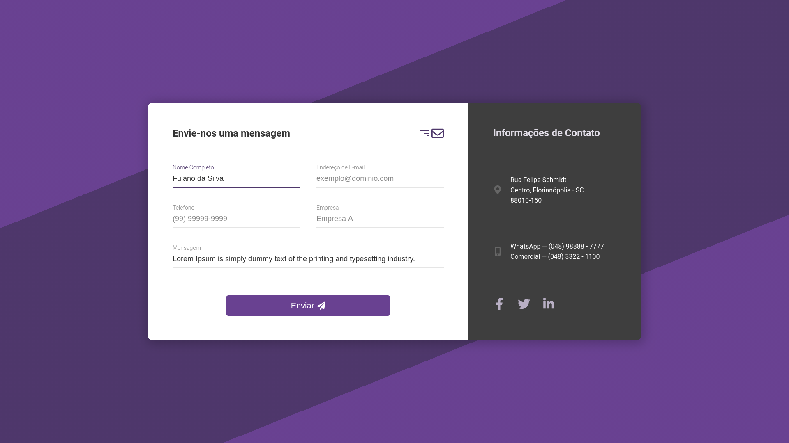

<h1 align="center">Formulário com Next.js + Google Planilhas</h1>

<p align="center" fontSize="60px">
  Armazene os dados de um formulário no Google Planilhas
</p>

<p align="center">
  
</p>

## 💻 Projeto

Esse projeto tem como objetivo apresentar uma forma gratuita e rápida para capturar e salvar os dados de um formulário web, sem a necessidade de pagar por um servidor com algum banco de dados ou depender de um serviço gratuito lento.

No [Google Cloud Platform](https://cloud.google.com/) é possível você cadastrar chaves para as aplicações do google, neste caso foi cadastrado uma chave para o serviço Google Sheets API. Com as credenciais em mãos basta carregá-las na lib [google-spreadsheet](https://github.com/theoephraim/node-google-spreadsheet) e enviar os dados do formulário através dela.

### Conceitos abordados

- Uso de flexbox para alinhar e ajustar elementos na página.

- Comunicação com serviços externos.

- Responsividade

- Componentização no React.

- Efeitos/Animações no CSS.

## :rocket: Tecnologias

-  [Next.js](https://nextjs.org/)
-  [TypeScript](https://www.typescriptlang.org/)
-  [Styled-components](https://www.styled-components.com/)
-  [React-Icons](https://react-icons.netlify.com/)
-  [Google SpreadSheet](https://github.com/theoephraim/node-google-spreadsheet/)
-  [Vercel](https://vercel.com/)

## 📥 Instalação e execução

Faça um clone desse repositório e acesse o diretório.

```bash
$ git clone git@github.com:LeeonardoVargas/contact-page-next.git && cd contact-page-next
```

Edite as seguintes VARIÁVEIS AMBIENTES no arquivo `env.example`:

```bash
# ID da sua planilha
GOOGLE_SHEET_ID=

# Email da sua credencial no Google Sheets API
GOOGLE_API_CLIENT_EMAIL=

# Chave privada da sua credencial no Google Sheets API
GOOGLE_API_PRIVATE_KEY=
```

```bash
# Instalando as dependências
$ yarn

# Executanto aplicação
$ yarn start

```

## :muscle: Contribuir

Faça o `fork` e clone o projeto a partir do seu usuário.

```bash
# Clonando projeto
$ git clone https://github.com/SEU-NOME-DE-USUARIO/contact-page-next.git

# Criando um branch
$ git branch minha-alteracao

# Acessando o novo branch
$ git checkout -b minha-alteracao

# Adicionando os arquivos alterados
$ git add .

# Criando commit e a mensagem
$ git commit -m "Corrigindo...."

# Enviando alterações para o brach
$ git push origin minha-alteracao
```
Você deve navegar até o seu repositório onde fez o fork e clicar no botão *New pull request* no lado esquerdo da página.

## 📝 Licença

Esse projeto está sob a licença MIT. Veja o arquivo [LICENSE](LICENSE.md) para mais detalhes.
